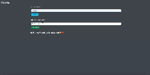

# FLASK App - Secret Wishlist

# Setup

I would suggest to make use of virtual environments to run any kind of application. (I personally use [pipenv](https://pipenv-fork.readthedocs.io/en/latest/basics.html))

`requirements.txt` can be found at top level directory of the project folder.

## Install pipenv

Windows Users

`pip install pipenv`

Mac/Linux Users

`pip3 install pipenv`

Use `pipenv shell` to create a virtual environment. Once, the environment is created.

If you only have a `requirements.txt` file available when running `pipenv install`, pipenv will automatically import the contents of this file and create a `Pipfile` for you.

You can also specify `pipenv install -r path/to/requirements.txt` to import a requirements file.

# Setting up Environment variables
There are many ways to set environment variables, below are 2 methods on setting environment variables.

#### 1. Using CLI
 1. We need to set an environment variable `FLASK_APP` on our machine. The value will be the entry point of our project(in our case it is `app.py`)
 
 2. Windows Users:  `set FLASK_APP=app.py`
 
 3. Mac/Linux Users: `export FLASK_APP=app.py`

#### 2. Using dotenv package
    
    1. Install python-dotenv package
    2. Create a .env file.
    3. Add the environment variables you want to create. eg: FLASK_APP="app.py"
   
   For more details on setting up environment variables check out : [Flask CLI](https://flask.palletsprojects.com/en/3.0.x/cli/#environment-variables-from-dotenv)

# Running the Flask Application

To run the application, activate the virtual environment and then write `flask run`

> Congratulations! 🎉 Your Flask application is ready and running @ http://127.0.0.1:5000/